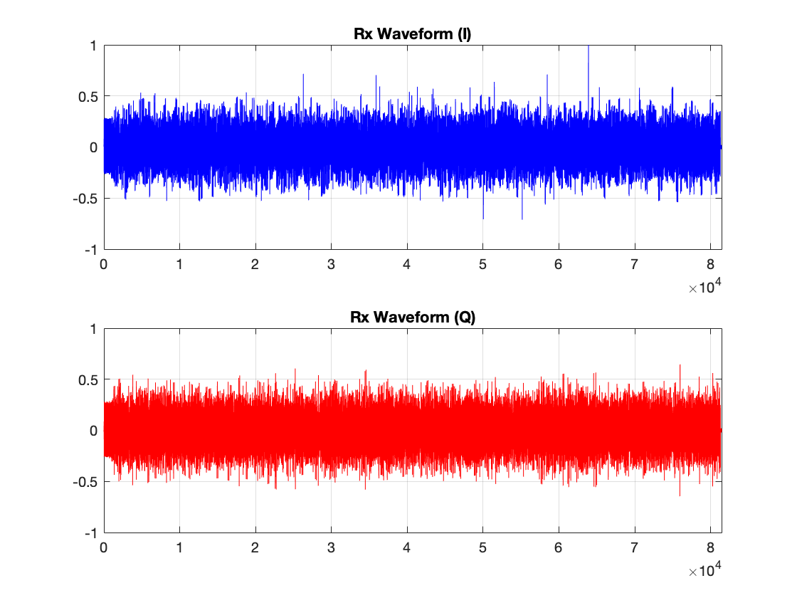
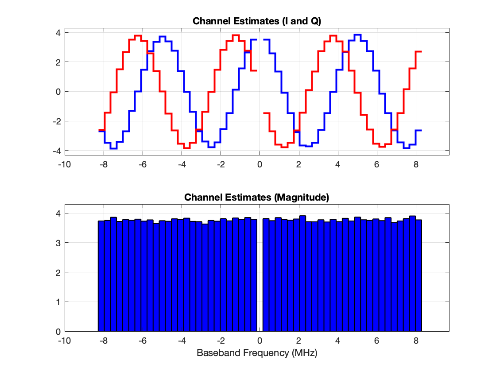
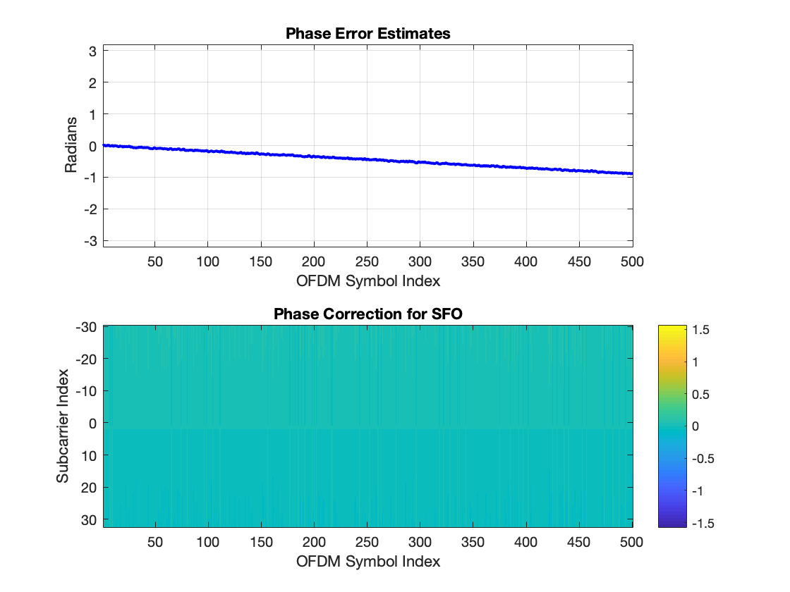
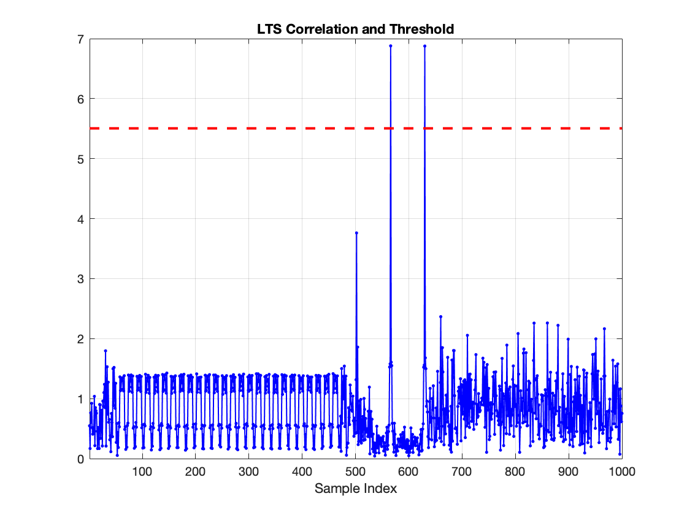
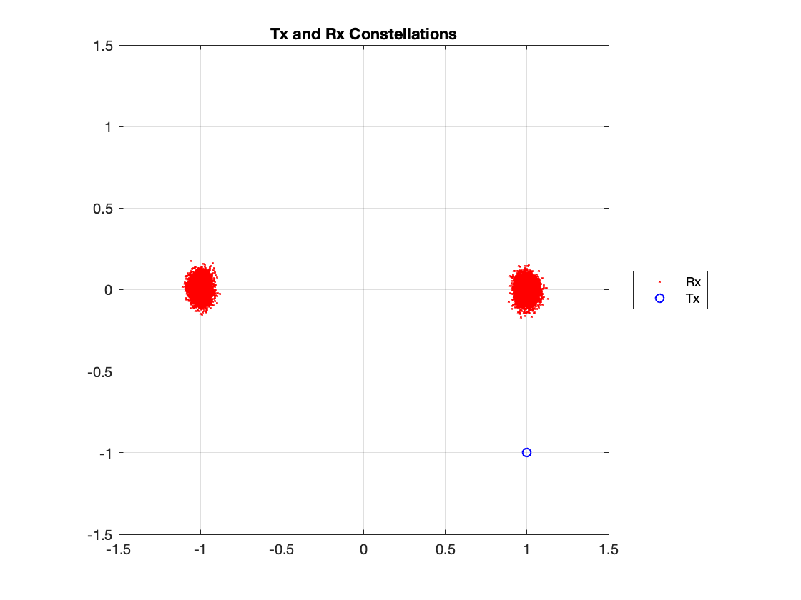
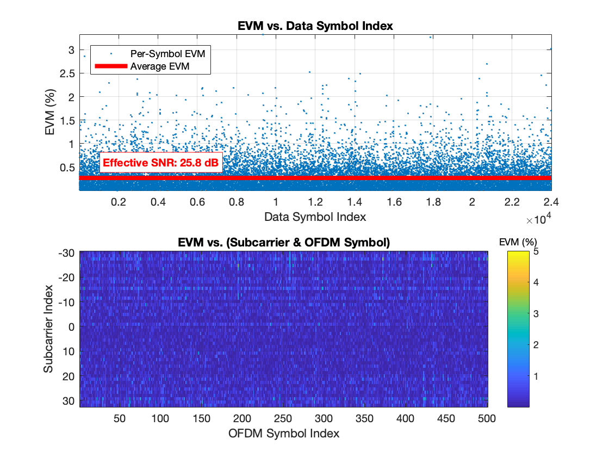
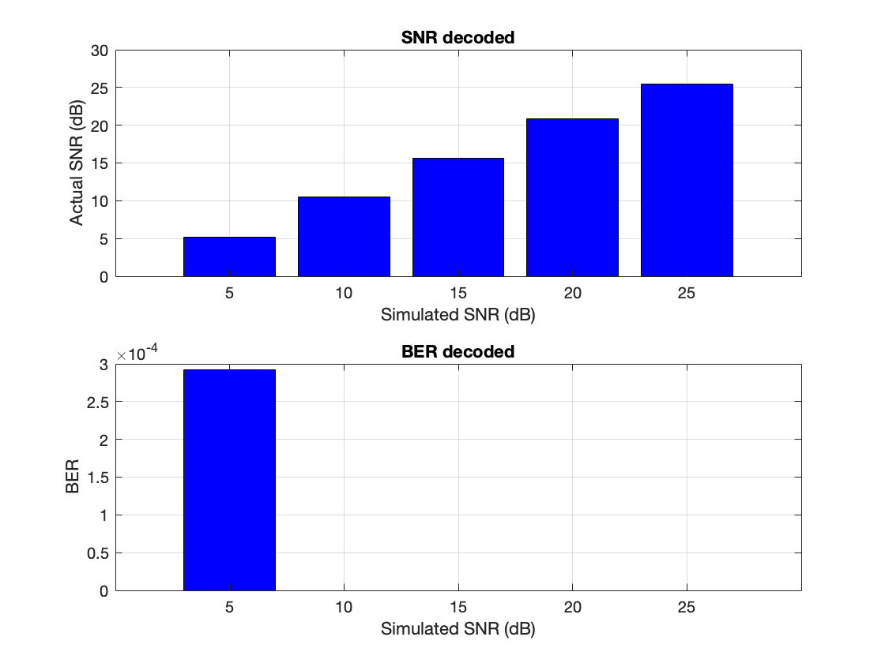

# Simple SISO OFDM in Simulation

This repository is going to simulate SISO OFDM with BPSK demodulation by using the example code on [WARPLab](https://warpproject.org/trac/wiki/WARPLab/Examples/OFDM) `wl_example_siso_ofdm_txrx.m`

> **NOTCIE:** This repository is the assignment in NCTU course "Wireless Communication Systems 2018". If you are taking this course, please do not duplicate from this repository. All rights reserved.

---
## Description

The sample code `wl_example_siso_ofdm_txrx.m` follows the following steps.
1. Generate OFDM transmit samples
2. Send samples via WARP or Simulation transmission
3. Decode the received samples
4. Calculate SNR/channels and plot

In the part of signal generation,
1. Generate preambles
2. Generate digital bits
3. Modulate digital bits to frequency-domain samples
4. Add pilot samples
5. Convert frequency sample to time samples via FFT
6. Insert CP (Cyclic Prefix)
7. Reshape symbols to 1D samples

In the part of decoding,
1. Packet detection
2. CFO correction (useless in simulation)
3. Channel estimation
4. Remove CP (Cyclic Prefix)
5. Convert time samples to frequency samples via FFT
6. Decode frequency samples
7. SFO correction

### BPSK OFDM Simulation

1. Partition the example code to `signal_gen.m` and `decode.m`
    * `signal_gen.m`
        * Signal generator and transmissions
        * Output transmitted digital bits to `tx_data.bin`
        * Output transmitted frequency-domain samples to `tx_syms_mat.bin`
        * Output received time-domain samples to `rx_vec_air.bin`
    * `decode.m`
        * Load `tx_data.bin`, `tx_syms_mat.bin`, and `rx_vec_air.bin`
        * Decode the signal and calculate BER/SNR
        * Plot the results
2. Simulation channels with different SNR values
    * Modify the modulation to BPSK
    * Currently, modulation 16-QAM is used
    * Change it to BPSK
3. Decode the received signals
    * Simulated SNR: 5, 10, 15, 20 and 25 (dB)
    * Generate received signal with noise
4. Calculate the actual SNR
    * Calculate decoded SNR and BER
5. Plot the mean SNR value
    * Plot SNR and BER
6. Plot figures in the example code
    * Plot other figures in the example code

---
## Execution

> **NOTICE:** Make sure you have already installed MATLAB on your machine

1. Open your MATLAB IDE and run `simulation.m` (take few minutes)
2. If succeed, you will get some figures as follow:
    * Tx waveform
        
    * Rx waveform
        
    * Channel Estimates
        
    * Phase Error Estimates and Phase Correction for SFO
        
    * LTS Correlation and Threshold
        
    * Tx and Rx Constellations
        
    * EVM vs. Data Index and EVM vs. (Subcarrier & OFDM Symbol)
        
    * Decoded SNR and BER
        

---
## Contributor

> **NOTICE:** You can follow the contributing process CONTRIBUTING.md to join me. I am very welcome any issue!

* [David Lu](https://github.com/yungshenglu)

---
## License

> **NOTCIE:** This repository is the assignment in NCTU course "Wireless Communication Systems 2018". If you are taking this course, please do not duplicate from this repository. All rights reserved.

[GNU GENERAL PUBLIC LICENSE Version 3](LICENSE)
